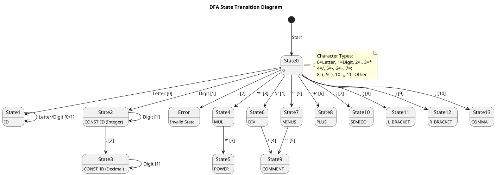

# 词法分析器实现细节

## 1. 概述

词法分析器负责将输入的源代码转换为token流。它从输入文件中读取字符，将它们分组为有意义的token，并将这些token传递给解析器。

## 2. 主要组件

### 2.1 Lexer 类

[Lexer](../..src/scanner/Lexer.py) 类是扫描器实现的核心。它处理文件读取、字符处理和token生成。

#### 关键方法：
- [__init__](../..src/scanner/Lexer.py)(self, file_path: str)：使用文件路径初始化词法分析器，以UTF-8编码和错误处理方式打开文件。
- [get_char](../..src/scanner/Lexer.py)(self) -> str：从文件中读取下一个字符并将其转换为大写以进行大小写不敏感处理。
- [back_char](../..src/scanner/Lexer.py)(self) -> None：将文件指针向后移动一个字符（换行符除外）。
- [pre_process](../..src/scanner/Lexer.py)(self) -> str：跳过空白字符并返回第一个非空白字符。
- [get_token](../..src/scanner/Lexer.py)(self) -> Token | None：使用TokenDFA识别并返回下一个token的核心方法。
- [close](../..src/scanner/Lexer.py)(self) -> None：关闭输入文件。

### 2.2 TokenDFA

扫描器使用TokenDFA进行token识别，该DFA在 [TokenDFA.py](../..src/scanner/TokenDFA.py) 中定义。

#### 字符类型：
0. 字母（包括下划线）
1. 数字
2. 句点 (.)
3. 星号 (*)
4. 斜杠 (/)
5. 连字符 (-)
6. 加号 (+)
7. 分号 (;)
8. 左括号 (()
9. 右括号 ())
10. 逗号 (,)
11. 其他字符

#### 状态：
- 状态 0：初始状态
- 状态 1：标识符 (ID)
- 状态 2：整数常量 (CONST_ID)
- 状态 3：小数常量 (CONST_ID)
- 状态 4：乘法运算符 (MUL)
- 状态 5：幂运算符 (**)
- 状态 6：除法运算符 (DIV)
- 状态 7：减法运算符 (MINUS)
- 状态 8：加法运算符 (PLUS)
- 状态 9：注释 (COMMENT)
- 状态 10：分号 (SEMICO)
- 状态 11：左括号 (L_BRACKET)
- 状态 12：右括号 (R_BRACKET)
- 状态 13：逗号 (COMMA)

### 2.3 Token 和 TokenType

token由 [Token](../..src/scanner/Token.py#L5-L18) 类表示，包括：
- type：来自 [TokenType](../..src/scanner/TokenType.py#L3-L32) 枚举的token类型
- lexeme：源代码中的原始字符串
- value：常量的数值
- func_ptr：数学函数的函数指针

[TokenType](../..src/scanner/TokenType.py#L3-L32) 枚举定义了所有可能的token类型，包括保留字、运算符、分隔符和特殊token。

## 3. token识别过程

[get_token](../..src/scanner/Lexer.py#L29-L94) 方法中的token识别过程包含三个主要步骤：

### 3.1 预处理
跳过所有空白字符并返回第一个非空白字符。

### 3.2 TokenDFA 状态转换
从初始状态 (0) 开始，使用 [TRANSITION_TABLE](../..src/scanner/TokenDFA.py#L14-L46) 根据字符类型在状态间移动。继续读取字符直到无法继续转换，然后回退一个字符。转换图如下:

### 3.3 后处理
根据最终状态，使用 [FINAL_STATE_TABLE](../..src/scanner/TokenDFA.py#L48-L62) 确定token类型。需要特殊处理的情况包括：
- ID：在符号表中查找以区分保留字和标识符
- 常量：将字符串转换为数值
- 注释：跳至行尾并继续扫描

## 4. 符号表

[Token.py](../..src/scanner/Token.py) 中的符号表包含预定义的标识符：
- 数学常量 (PI, E)
- 参数 (T)
- 数学函数 (SIN, COS, TAN, SQRT, EXP, LN)
- 保留字 (ORIGIN, SCALE, ROT, IS, FOR, FROM, TO, STEP, DRAW)

[lookup_symbol](../..src/scanner/Token.py#L44-L58) 函数用于区分用户定义的标识符和预定义的标识符。

## 5. 错误处理

扫描器处理各种错误情况：
- 无效字符：无法启动任何有效token的字符
- 无效编码：由于 `errors="ignore"` 参数，非UTF-8字符被忽略
- 格式错误的数字：无法转换为浮点数的数字

发生错误时，返回 ERRTOKEN，允许解析器适当地处理错误。

## 6. 特殊功能

### 6.1 大小写不敏感
所有输入都被转换为大写进行处理，使语言大小写不敏感。

### 6.2 注释支持
支持两种类型的注释：
- 以 // 开头的行注释
- 以 -- 开头的行注释

这两种都在token化过程中被识别和跳过。

### 6.3 多字符运算符
扫描器正确识别多字符运算符如 **（幂运算）并将其与单字符运算符区分开来。