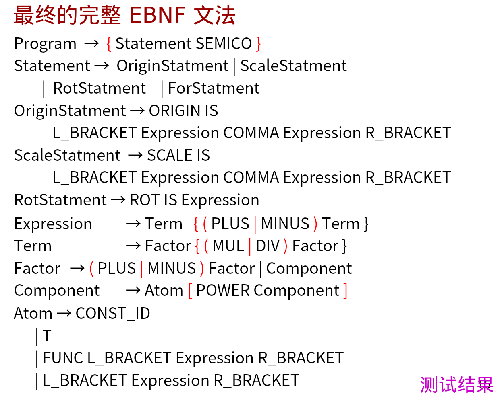

# 原创性工作说明

## 修改点1：#号单行注释支持
### 修改点说明：
增加了对Python风格的单行注释（#）的支持，丰富了注释语法的多样性。

### 修改的方式（代码的解释）：
1. 在 [TokenDFA.py](../src/scanner/TokenDFA.py) 中添加了字符类型12来表示#号字符
    ```python
    elif ch == "#":
        return 12
    ```
2. 增加了从初始状态0到状态9的转移规则，当遇到#号时识别为[COMMENT](../src/scanner/TokenType.py)
3. 复用了现有的单行注释处理逻辑，在[Lexer.py](../src/scanner/Lexer.py)的主循环中通过continue跳过注释内容到行尾

## 修改点2：多行注释支持
### 修改点说明：
增加了对C语言风格的多行注释（`/* */`）的支持，使词法分析器能够正确识别和跳过多行注释内容。

### 修改的方式：
1. 在 [TokenType.py](../src/scanner/TokenType.py) 中新增了[COMMENT_START](../src/scanner/TokenType.py)枚举类型
2. 在 [TokenDFA.py](../src/scanner/TokenDFA.py) 中扩展了状态转移表，增加了状态14[COMMENT_START](../src/scanner/TokenDFA.py)
3. 增加了从状态6（/）到状态14的转移，状态6`/`情况下再遇到`*`时识别为[COMMENT_START](../src/scanner/TokenType.py)
4. 在 [Lexer.py](../src/scanner/Lexer.py) 中添加了专门处理[COMMENT_START](../src/scanner/TokenType.py)的逻辑，循环读取字符直到遇到[*/](../Compiler_c/README.TXT)结束符
   ```python
   elif token.type == TokenType.COMMENT_START:
    # 多行注释开始，跳过到结束符 */
    while True:
        comment_char = self.get_char()
        if comment_char == "":  # 文件结束
            break
        if comment_char == "*":
            # 检查下一个字符是否为 /
            next_char = self.get_char()
            if next_char == "/":
                # 找到结束符 */
                break
            else:
                # 不是结束符，回退字符
                self.back_char()
    continue  # 继续进入循环，获取下一个记号
   ```
   直接用代码识别多行注释结尾, 而不是继续通过状态转移直到多行注释结束, 避免了过多无用的状态转移

### 修改中遇到的问题及解决方案：
#### 问题1：多行注释的结束符[*/](../Compiler_c/README.TXT)是两个字符组成的序列，不能简单地当作单个字符处理
- 解决方案：在检测到星号(*)字符后，立即读取下一个字符检查是否为斜杠(/)，如果不是则使用[back_char()](../src/scanner/Lexer.py)方法回退字符，确保不会遗漏注释内容中的星号字符
#### 问题2: 多行注释如果没有匹配到`*/`，直到文末也没有报错
- 解决方案: 在词法分析遇到多行注释符开始符号`/*`时，如果直到文末也没有匹配到, 则判定为ERRTOKEN
  ```python
   elif token.type == TokenType.COMMENT_START:
   # 多行注释开始，跳过到结束符 */
   while True:
     comment_char = self.get_char()
     if comment_char == "":  # 文件结束
         token.type = TokenType.ERRTOKEN
         token.lexeme = "Unterminated comment"
         return token
  ```

## 修改点3: 提供STYLE语句支持颜色, 线条粗细, 透明度设置
### STYLE语句的实现说明

#### 1. EBNF文法扩展

为了支持STYLE语句，扩展了以下EBNF文法：

```
Statement       → ... | StyleStatement
StyleStatement  → STYLE IS STYLEVALUE
STYLEVALUE      → COLOR | CONST_ID | ( COLOR [, CONST_ID [, CONST_ID] ] )
```

该文法定义了三种STYLEVALUE格式：
- 单独颜色：`STYLE IS RED;`
- 单独线条粗细：`STYLE IS 1.5;`
- 复合格式：`STYLE IS (RED, 0.5, 2.0);`

#### 2. 递归下降函数实现

##### 2.1 [style_statement](../src/parser/Parser.py) 函数
```python
def style_statement(lexer: Lexer) -> None:
    match_token(TokenType.STYLE, lexer)
    match_token(TokenType.IS, lexer)
    color, opacity, line_width = style_value(lexer)
    # 更新全局配置
```


##### 2.2 [style_value](../src/parser/Parser.py) 函数
这是核心解析函数，根据当前记号类型处理三种不同的STYLEVALUE格式：

1. **COLOR格式**：直接匹配颜色关键字
2. **CONST_ID格式**：匹配数值常量作为线条粗细
3. **括号复合格式**：按顺序解析颜色、可选透明度和可选线条粗细

##### 2.3 [statement](../src/parser/Parser.py) 函数扩展
在语句分发函数中增加了对[TokenType.STYLE](../src/scanner/TokenType.py)类型的处理分支，调用[style_statement](../src/parser/Parser.py)函数。

#### 3. 辅助功能

##### 3.1 语义检查函数
- [check_non_negative](../src/parser/Parser.py#L41-L46)：确保透明度和线条粗细为非负值
- [check_opacity](../src/parser/Parser.py#L48-L53)：确保透明度在0-1范围内

##### 3.2 全局样式配置
使用[style_config](../src/parser/Parser.py)字典存储当前的样式设置，包括颜色、透明度和线条粗细三个属性。

通过以上扩展，完整实现了STYLE语句的词法分析、语法分析和语义检查功能。


## 修改点4: 幂函数与一元+/-运算符的优先级调整

#### 问题：处理幂运算和自增自减符号时的优先级错误

在处理 `origin is (2**-2, 0);` 这样的表达式时，可能会出现以下错误：

```
origin is (2**-2, 0);           // 应该是 2**(-2)=0.25
Syntax parsing failed: Syntax Error：Not a valid atom: '-'
```

在Python自己的编译器中, `2**-2`的结果是0.25, 因此我们的编译器也应该先允许`-2`进行完一个`0-2`的factor一元减运算, 再作为指数参与`2**(-2)`幂运算。

#### 原因分析

问题出在 [component](../src/parser/Parser.py) 的推导文法中。在PPT给出的EBNF文法中，当处理幂运算时，会形成以下的推导:

`Component -> Atom POWER Component -> Atom POWER Component -> Atom POWER Atom [POWER Component]`

也就是说如果出现幂运算, 只允许`CONST_ID`作为指数, 这里的`CONST_ID`只能是1,2,3这种自然数, 如果遇到了-1这种负数, 获取到的token是`-`而不是`CONST_ID`,因此会出现上面的报错

#### 解决方案

修改 [component](../src/parser/Parser.py) 函数，将幂运算右侧的解析从 [component](../src/parser/Parser.py) 改为 [factor](../src/parser/Parser.py)，允许先进行一元+/-的计算：

```python
def component(lexer: Lexer) -> ExprNode:
    """Component → Atom [ POWER Component ]（右结合）"""
    left_node = atom(lexer)
    global current_token
    while current_token.type == TokenType.POWER:
        op_token = current_token
        match_token(TokenType.POWER, lexer)
        # **右边如果是factor, 允许先进行一元+/-的计算
        right_node = factor(lexer)
        left_node = make_expr_node(op_token.type, left_node, right_node)
    return left_node
```

这样修改后，表达式 `2**-2` 能够被正确解析为 `2**(-2)`，从而解决了该语法错误问题。


## TODO: 修改点5：错误行号定位


## TODO: 修改点6: 词法分析时遇到错误不直接中断