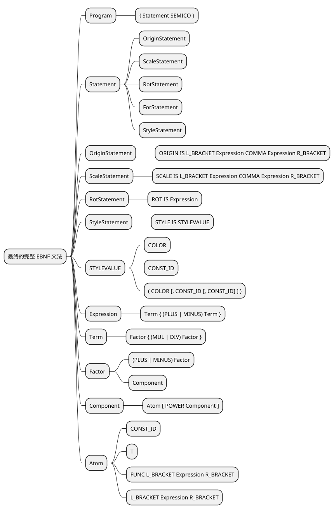

# 语法分析器实现细节

## 1. 概述

语法分析器负责将词法分析器产生的Token流转换为抽象语法树(AST)。它使用递归下降解析方法，根据预定义的语法规则对Token流进行分析，并构建表达式的语法树结构。

## 2. 主要组件

### 2.1 Parser 类

Parser模块主要由递归下降解析函数组成，每个语法规则对应一个函数。

#### 关键方法：

- [parse(file_path: str)](../../src/parser/Parser.py)：解析器入口函数，初始化词法分析器并启动语法分析
- [program(lexer: Lexer)](../../src/parser/Parser.py)：处理程序主体，解析语句序列
- [statement(lexer: Lexer)](../../src/parser/Parser.py)：处理各种语句类型
- [expression(lexer: Lexer)](../../src/parser/Parser.py)：处理表达式（加法、减法运算）
- [term(lexer: Lexer)](../../src/parser/Parser.py)：处理项（乘法、除法运算）
- [factor(lexer: Lexer)](../../src/parser/Parser.py)：处理因子（一元运算）
- [component(lexer: Lexer)](../../src/parser/Parser.py)：处理组件（幂运算）
- [atom(lexer: Lexer)](../../src/parser/Parser.py)：处理原子（常量、变量、函数调用、括号表达式）

### 2.2 ExprNode 类

[ExprNode](../../src/parser/ExprNode.py) 类表示语法树节点，用于构建表达式的树形结构。

#### 节点属性：
- [op_code](../../src/parser/ExprNode.py)：节点类型（如PLUS、MINUS、CONST_ID等）
- [left](../../src/parser/ExprNode.py)：左子节点（二元运算用）
- [right](../../src/parser/ExprNode.py)：右子节点（二元运算用）
- [child](../../src/parser/ExprNode.py)：子节点（函数调用/一元运算用）
- [const_val](../../src/parser/ExprNode.py)：常数值（CONST_ID用）
- [param_ptr](../../src/parser/ExprNode.py)：参数指针（T用，绑定全局参数T）
- [func_ptr](../../src/parser/ExprNode.py)：函数指针（FUNC用）

## 3. 语法规则实现

### 3.1 EBNF 文法

语法分析器基于以下EBNF文法实现：

```
Program         → { Statement SEMICO }
Statement       → OriginStatement | ScaleStatement | RotStatement | ForStatement | StyleStatement
OriginStatement → ORIGIN IS L_BRACKET Expression COMMA Expression R_BRACKET
ScaleStatement  → SCALE IS L_BRACKET Expression COMMA Expression R_BRACKET
RotStatement    → ROT IS Expression
StyleStatement  → STYLE IS STYLEVALUE
STYLEVALUE      → COLOR | CONST_ID | ( COLOR [, CONST_ID [, CONST_ID] ] )
Expression      → Term { (PLUS | MINUS) Term }
Term            → Factor { (MUL | DIV) Factor }
Factor          → (PLUS | MINUS) Factor | Component
Component       → Atom [ POWER Component ]
Atom            → CONST_ID | T | FUNC L_BRACKET Expression R_BRACKET | L_BRACKET Expression R_BRACKET
```



### 3.2 运算符优先级和结合性

语法分析器正确处理了各种运算符的优先级和结合性：

1. 括号 `()` - 最高优先级
2. 幂运算 `**` - 右结合
3. 一元运算 `+` `-` - 右结合
4. 乘除运算 `*` `/` - 左结合
5. 加减运算 `+` `-` - 左结合

## 4. 递归下降解析实现

### 4.1 入口流程

解析过程从 [parse](../../src/parser/Parser.py) 接口开始：

1. [`parse`](../../src/parser/Parser.py) 函数初始化 [Lexer](../../src/scanner/Lexer.py) 并调用 [`program`](../../src/parser/Parser.py)
2. [`program`](../../src/parser/Parser.py) 通过 [fetch_token](../../src/parser/Parser.py) 获取第一个记号，然后进入语句循环

### 4.2 语句级处理流程

[`program`](../../src/parser/Parser.py) 循环中，每次迭代执行：

1. 调用 [`statement`](../../src/parser/Parser.py) 处理单条语句
2. 通过 [match_token(TokenType.SEMICO, lexer)](../../src/parser/Parser.py) 匹配语句结束分号

[`statement`](../../src/parser/Parser.py) 根据当前记号类型分发到具体语句处理函数：

- `ORIGIN` → [`origin_statement`](../../src/parser/Parser.py)
- `SCALE` → [`scale_statement`](../../src/parser/Parser.py)
- `ROT` → [`rot_statement`](../../src/parser/Parser.py)
- `FOR` → [`for_statement`](../../src/parser/Parser.py)
- `STYLE` → [`style_statement`](../../src/parser/Parser.py)

### 4.3 表达式解析流程

在各语句处理函数中，当需要解析表达式时，调用链如下：

1. [`expression`](../../src/parser/Parser.py) - 处理加法/减法运算
2. [`term`](../../src/parser/Parser.py) - 处理乘法/除法运算
3. [`factor`](../../src/parser/Parser.py) - 处理一元运算
4. [`component`](../../src/parser/Parser.py) - 处理幂运算
5. [`atom`](../../src/parser/Parser.py) - 处理原子表达式

## 5. 错误处理

### 5.1 语法错误

语法分析器在遇到不符合语法规则的Token序列时会抛出语法错误，例如：

```
Syntax parsing failed: Syntax Error：Not a valid atom: '-'
```

### 5.2 问题案例及解决方案

#### 问题：处理幂运算和自增自减符号时的优先级错误

在处理 `origin is (2**-2, 0);` 这样的表达式时，可能会出现以下错误：

```
origin is (2**-2, 0);           // 应该是 2**(-2)=0.25
Syntax parsing failed: Syntax Error：Not a valid atom: '-'
```

在Python自己的编译器中, `2**-2`的结果是0.25, 因此我们的编译器也应该先允许`-2`进行完一个`0-2`的factor一元减运算, 再作为指数参与`2**(-2)`幂运算。

#### 原因分析

问题出在 [component](../../src/parser/Parser.py) 的推导文法中。在PPT给出的EBNF文法中，当处理幂运算时，会形成以下的推导:

`Component -> Atom POWER Component -> Atom POWER Component -> Atom POWER Atom [POWER Component]`

也就是说如果出现幂运算, 只允许`CONST_ID`作为指数, 这里的`CONST_ID`只能是1,2,3这种自然数, 如果遇到了-1这种负数, 获取到的token是`-`而不是`CONST_ID`,因此会出现上面的报错

#### 解决方案

修改 [component](../../src/parser/Parser.py) 函数，将幂运算右侧的解析从 [component](../../src/parser/Parser.py) 改为 [factor](../../src/parser/Parser.py)，允许先进行一元+/-的计算：

```python
def component(lexer: Lexer) -> ExprNode:
    """Component → Atom [ POWER Component ]（右结合）"""
    left_node = atom(lexer)
    global current_token
    while current_token.type == TokenType.POWER:
        op_token = current_token
        match_token(TokenType.POWER, lexer)
        # **右边如果是factor, 允许先进行一元+/-的计算
        right_node = factor(lexer)
        left_node = make_expr_node(op_token.type, left_node, right_node)
    return left_node
```

这样修改后，表达式 `2**-2` 能够被正确解析为 `2**(-2)`，从而解决了该语法错误问题。

## 6. 样式语句解析

样式语句（StyleStatement）支持设置绘图的颜色、透明度和线条粗细：
STYLE语句方式有三种文法推导：
- `STYLE IS COLOR;`: 设置颜色, 使用`(BLACK, WHITE, RED, GREEN, BLUE, YELLOW)`这些规定好的关键字
- `STYLE IS LINE_WIDTH(CONST_ID);`: 设置线条宽度
- `STYLE IS (COLOR [, OPACITY [, LINE_WIDTH] ]);`: 设置颜色、透明度和线条宽度

```python
def style_value(lexer: Lexer) -> tuple:
    """STYLEVALUE → COLOR | CONST_ID | ( COLOR [, CONST_ID [, CONST_ID] ] )"""
    # 实现三种格式的支持：
    # 1. 单独颜色：STYLE IS RED;
    # 2. 单独线条粗细：STYLE IS 1.5;
    # 3. 复合格式：STYLE IS (RED, 0.5, 2.0);
```

## 7. 测试验证

通过多个测试文件验证语法分析器的正确性：

- [correct_test.txt](../../test/correct_test.txt)：验证正确语法的解析
- [error_test.txt](../../test/error_test.txt)：验证错误处理机制
- [expression_test.txt](../../test/expression_test.txt)：验证表达式优先级和结合性
- [style_test.txt](../../test/style_test.txt)：验证样式语句解析