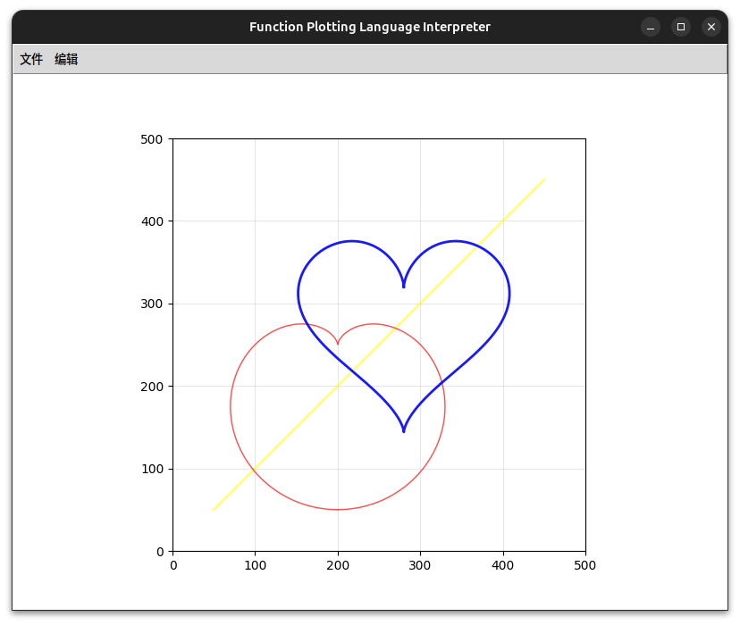

# 语义分析器实现细节

## 1. 概述

语义分析器负责处理语法分析器生成的抽象语法树(AST)，执行实际的语义动作，如计算表达式的值、进行坐标变换以及绘制图形。它与语法分析器紧密结合，在解析每个语句时立即执行相应的语义动作。

## 2. 主要组件

### 2.1 SemanticContext 模块

SemanticContext模块负责存储全局绘图上下文和状态变量，是语义分析的核心数据存储。

#### 关键变量：

- `Origin_x`, `Origin_y`：平移原点坐标
- `Rot_ang`：旋转角度（弧度）
- `Scale_x`, `Scale_y`：X轴和Y轴缩放因子
- `Parameter_T`：FOR循环中的参数T值
- `StyleConfig`：绘图样式配置（颜色、透明度、线条宽度） 
    ```python
    StyleConfig = {
    "color": "#000000",    # 线条颜色（默认黑色）
    "opacity": 1.0,        # 透明度（0~1，默认不透明）
    "line_width": 1.0,     # 线条宽度（默认1.0）
    }
    ```
- `CachedPoints`：坐标缓存列表，用于批量绘制
    ```python
    CachedPoints = {
    "x": [],  # 缓存所有变换后的 X 坐标
    "y": []   # 缓存所有变换后的 Y 坐标
    }
    ```
- `AxisRange`：记录所有绘制点的xy坐标范围

#### 关键方法：

- `reset_context()`：重置所有全局参数和缓存，用于清空画布

### 2.2 SemanticUtils 模块

SemanticUtils模块包含语义分析的核心功能函数，负责表达式求值、坐标变换和图形绘制。

#### 关键方法：

- `get_expr_value(root: ExprNode) -> float`：深度优先后序遍历语法树，计算表达式值
- `calc_coord(x_expr: ExprNode, y_expr: ExprNode) -> tuple[float, float]`：坐标变换：原始坐标 → 缩放 → 旋转 → 平移
- `cache_points(start_expr: ExprNode, end_expr: ExprNode, step_expr: ExprNode, x_expr: ExprNode, y_expr: ExprNode) -> None`：根据FOR语句参数生成并缓存所有坐标点
- `batch_draw(ax: plt.Axes) -> None`：使用matplotlib批量绘制缓存的坐标点

## 3. 与语法分析器的集成

语义分析器与语法分析器采用紧密集成的方式，每个语句在语法分析完成后立即执行相应的语义动作。

### 3.1 集成方式

1. 语法分析器的[parse](../../src/parser/Parser.py)函数现在接受一个额外的`ax`参数（matplotlib的坐标轴对象）
2. 在每个语句处理函数中嵌入语义动作：
   - [`origin_statement`](../../src/parser/Parser.py)：计算并设置平移原点
   - [`scale_statement`](../../src/parser/Parser.py)：计算并设置缩放因子
   - [`rot_statement`](../../src/parser/Parser.py)：计算并设置旋转角度
   - [`style_statement`](../../src/parser/Parser.py)：更新样式配置
   - [`for_statement`](../../src/parser/Parser.py)：计算坐标点并绘制图形

### 3.2 数据传递

语义分析器通过以下方式与语法分析器传递数据：

1. 通过共享的`SemanticContext`模块存储和访问全局状态
2. 语法分析器将构建好的表达式语法树传递给语义分析器进行求值
3. 语法分析器将matplotlib的坐标轴对象传递给语义分析器用于绘图

## 4. 语义动作实现

### 4.1 表达式求值

使用[get_expr_value](../../src/semantics/SemanticUtils.py)函数对表达式语法树进行深度优先遍历计算：

1. 常数节点：直接返回常数值
2. 参数节点(T)：返回全局变量T的值
3. 函数节点：计算子表达式值后调用函数指针
4. 运算符节点：递归计算左右子树并执行相应运算

### 4.2 坐标变换

通过[calc_coord](../../src/semantics/SemanticUtils.py)函数实现从数学坐标到屏幕坐标的变换：

1. 计算原始坐标值（基于T的表达式值）
2. 应用缩放变换
3. 应用旋转变换（弧度制，逆时针为正）
4. 应用平移变换

### 4.3 图形绘制

图形绘制分为两个阶段：

1. [cache_points](../../src/semantics/SemanticUtils.py)函数根据FOR语句的参数生成所有坐标点并缓存：
   - 计算循环参数（起始值、结束值、步长）
   - 遍历T值，计算每个点的坐标并存储到缓存中

2. [batch_draw](../../src/semantics/SemanticUtils.py)函数使用matplotlib批量绘制缓存的点：
   - 从样式配置中获取颜色、线条宽度和透明度
   - 使用matplotlib的plot函数绘制所有点
   - 计算并更新坐标范围信息

## 5. 坐标范围管理

### 5.1 AxisRange的作用

[AxisRange](../../src/semantics/SemanticContext.py)用于记录所有绘制点的坐标范围，以便自动调整绘图区域。

### 5.2 set_axes_range函数

[set_axes_range](../../src/main.py)函数用于自动调整绘图区域以适应所绘制的图形：

1. 在加载脚本后调用，传入从语义分析中收集的坐标范围信息
2. 通过扩展图形的边界（每边增加50个单位）确保整个图形都能完整显示在画布上
3. 刷新画布以显示更新后的视图

## 6. 错误处理

语义分析器处理各种语义错误：

1. 除零错误：在表达式求值过程中检测并报告除零错误
2. 步长错误：检查FOR语句的步长是否为正数
3. 参数匹配错误：检查FOR语句的起始值、结束值和步长是否匹配

## 7. 测试验证

通过多个测试文件验证语义分析器的正确性：

- [correct_test.txt](../../test/correct_test.txt)：验证正确语义的执行
- [coverage_test.txt](../../test/coverage_test.txt)：验证心形图片的绘制
    
- [style_test.txt](../../test/style_test.txt)：验证样式设置的正确性